upstream->input_filter and output_filter
========================================


## ngx_http_upstream_connect call graph

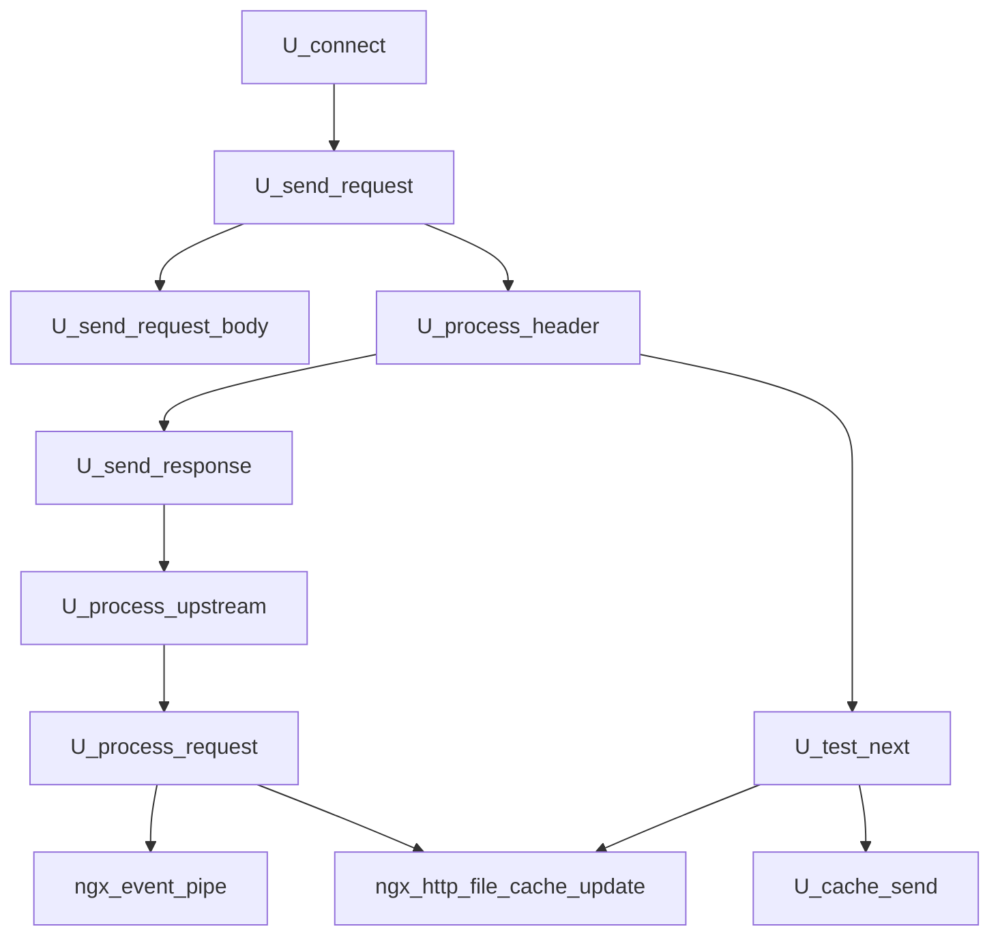

## c->write->handler & c->read->handler

* ngx_http_upstream_connect

```
c->write->handler = ngx_http_upstream_handler;
c->read->handler = ngx_http_upstream_handler;
```

* ngx_http_upstream_ssl_handshake

```
c->write->handler = ngx_http_upstream_handler;
c->read->handler = ngx_http_upstream_handler;
```

## read_event_handler & write_event_handler

* ngx_http_upstream_init_request

```
if (r->aio) {
    return;
}
...(snip)...
if (u->conf->cache) {
    rc = ngx_http_upstream_cache(r, u);
    if (rc == NGX_BUSY) {
        r->write_event_handler = ngx_http_upstream_init_request;
        return;
    }
    r->write_event_handler = ngx_http_request_empty_handler;
...(snip)...
}
...(snip)...
if (!u->store && !r->post_action && !u->conf->ignore_client_abort) {
    r->read_event_handler = ngx_http_upstream_rd_check_broken_connection;
    r->write_event_handler = ngx_http_upstream_wr_check_broken_connection;
```

* ngx_http_upstream_connect

```
u->write_event_handler = ngx_http_upstream_send_request_handler;
u->read_event_handler = ngx_http_upstream_process_header;
```

* ngx_http_upstream_send_request

```
if (!u->conf->preserve_output) {
    u->write_event_handler = ngx_http_upstream_dummy_handler;
}
```

* ngx_http_upstream_send_request_handler

```
if (u->header_sent && !u->conf->preserve_output) {
    u->write_event_handler = ngx_http_upstream_dummy_handler;
```

* ngx_http_upstream_send_request_body

```
if (!u->request_sent) {
...(snip)...
    r->read_event_handler = ngx_http_upstream_read_request_handler;
...(snip)...
}
...(snip)...
if (!r->reading_body) {
    if (!u->store && !r->post_action && !u->conf->ignore_client_abort) {
        r->read_event_handler = ngx_http_upstream_rd_check_broken_connection;
    }
}
```

* ngx_http_upstream_send_response

```
if (!u->buffering) {
...(snip)...
    u->read_event_handler = ngx_http_upstream_process_non_buffered_upstream;
    r->write_event_handler = ngx_http_upstream_process_non_buffered_downstream;
...(snip)...
}
...(snip)...

u->read_event_handler = ngx_http_upstream_process_upstream;
r->write_event_handler = ngx_http_upstream_process_downstream;
ngx_http_upstream_process_upstream(r, u);
```

* ngx_http_upstream_upgrade

```
u->read_event_handler = ngx_http_upstream_upgraded_read_upstream;
u->write_event_handler = ngx_http_upstream_upgraded_write_upstream;
r->read_event_handler = ngx_http_upstream_upgraded_read_downstream;
r->write_event_handler = ngx_http_upstream_upgraded_write_downstream;
```

* ngx_http_upstream_finalize_request

```
r->read_event_handler = ngx_http_block_reading;
```

## c->write->handler call graph

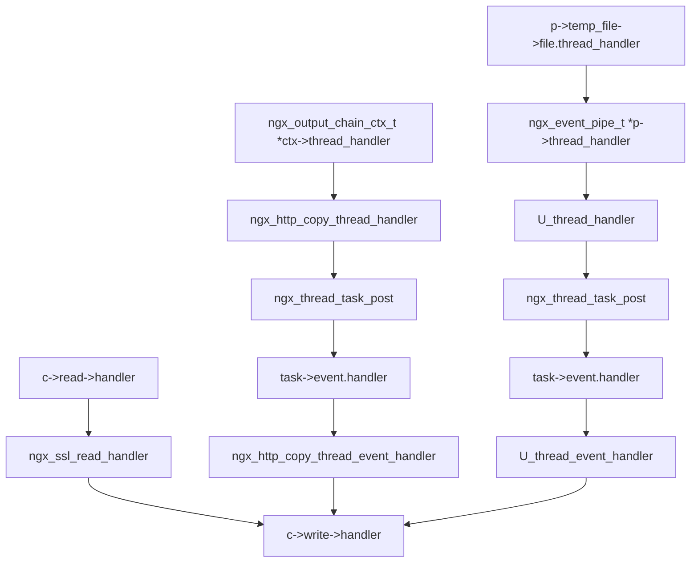

## c->read->handler call graph

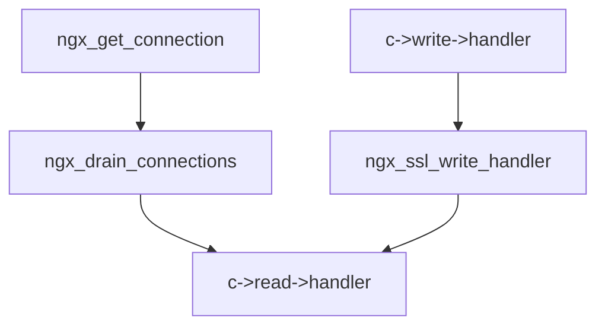


## ngx_http_upstream_handler call graph

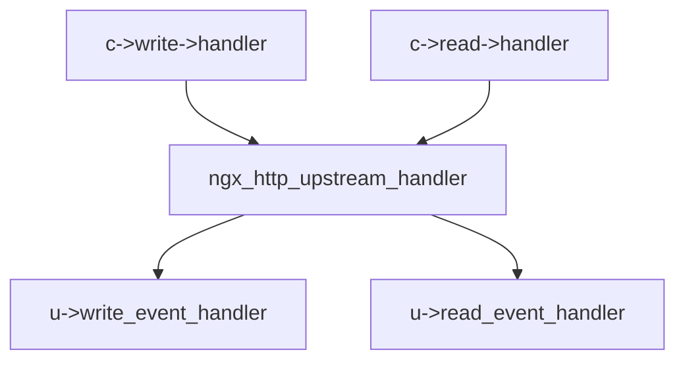

## ngx_event_pipe call graph

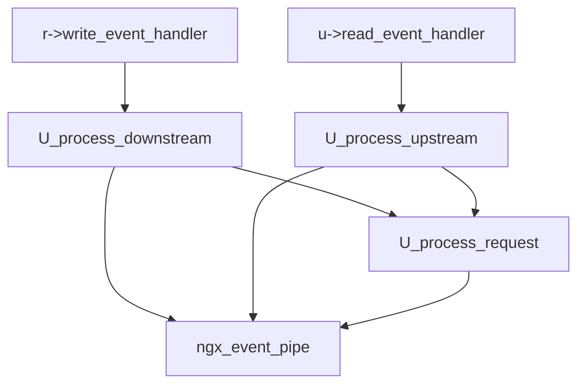

## ngx_http_upstream_connect call graph
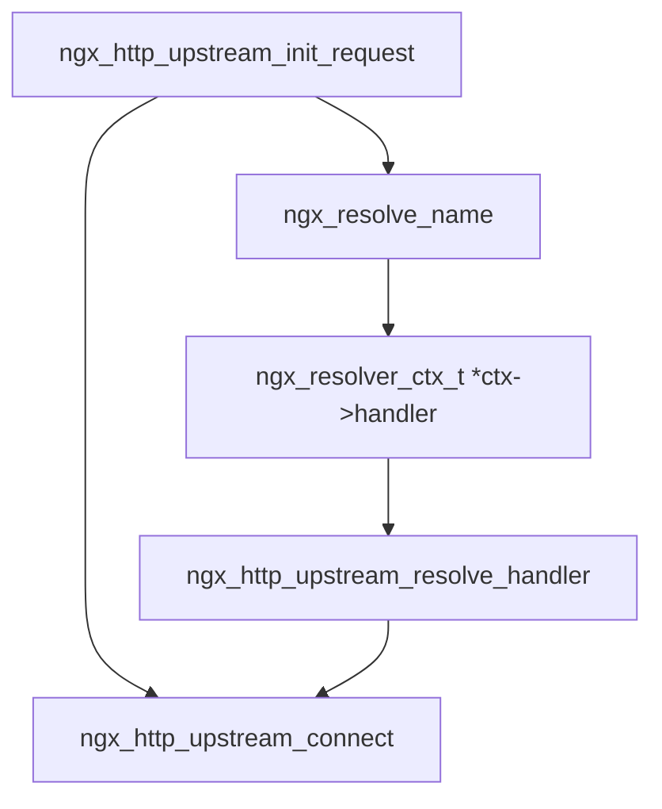

## ngx_http_top_request_body_filter call graph

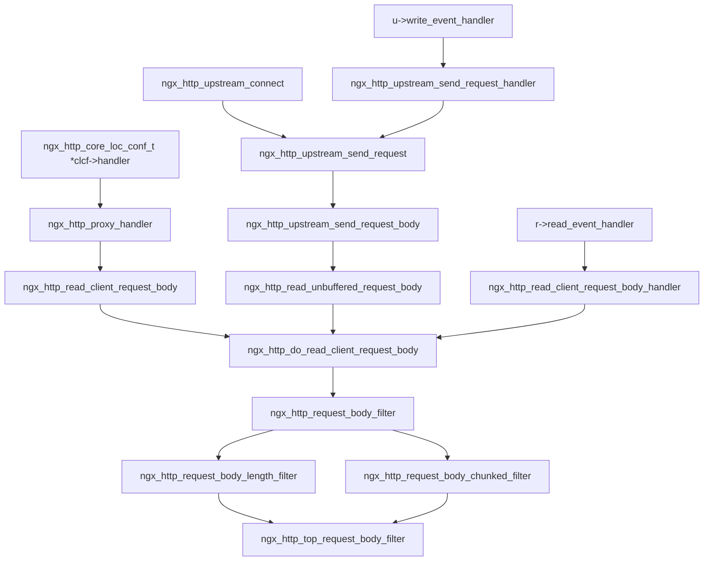


## p->temp_file->file.thread_handler call graph

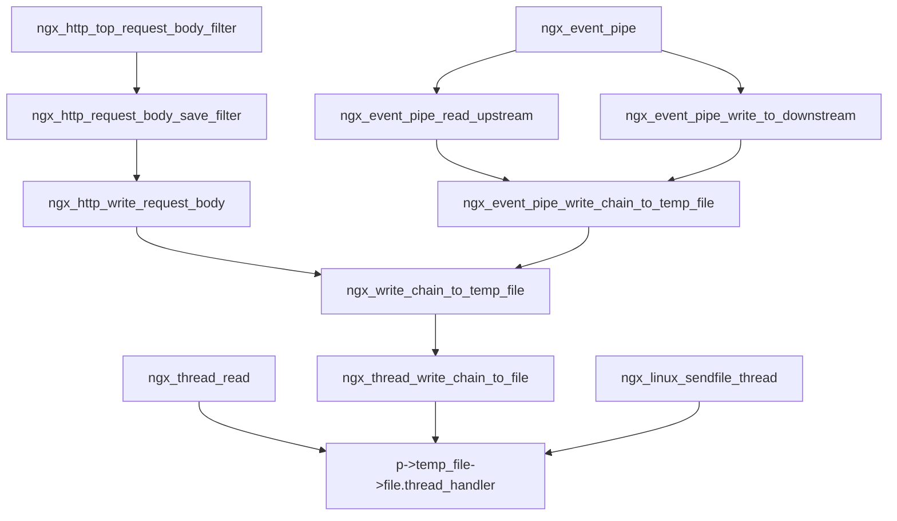

## pipe->output_filter call graph

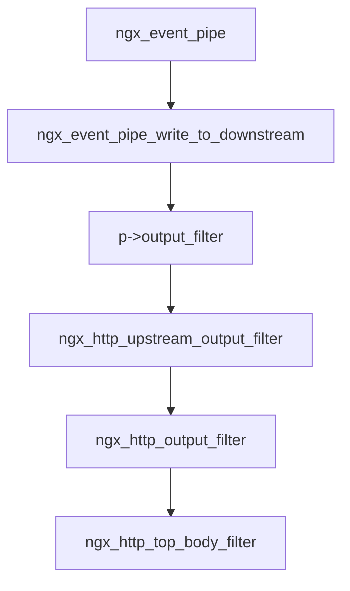

## ngx_http_top_body_filter

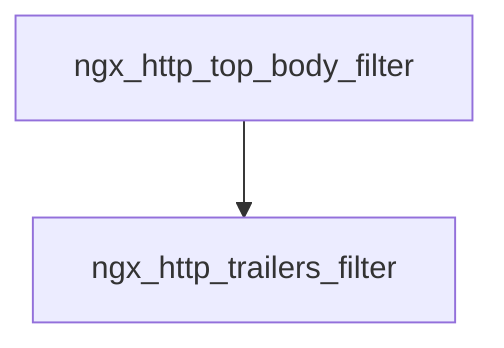

## ngx_http_upstream_process_headers call graph

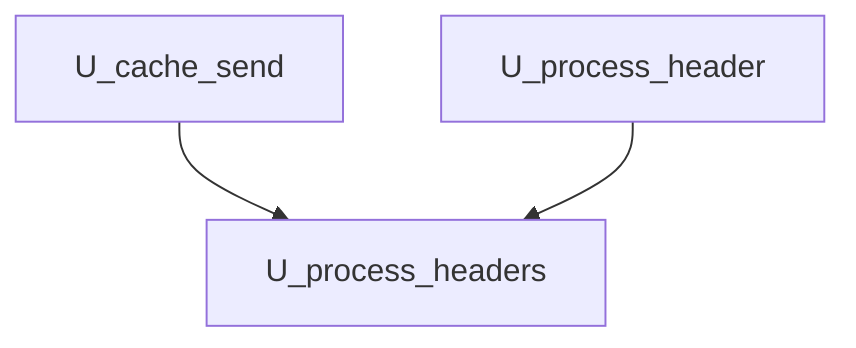

## upstream->input_filter

### 定義箇所
[struct ngx_http_upstream_s](https://github.com/nginx/nginx/blob/release-1.22.0/src/http/ngx_http_upstream.h#L323-L404) 内の [ngx_int_t (*input_filter_init)(void *data);](https://github.com/nginx/nginx/blob/release-1.22.0/src/http/ngx_http_upstream.h#L355)

### 設定箇所
[ngx_http_proxy_non_buffered_copy_filter(void *data, ssize_t bytes)](https://github.com/nginx/nginx/blob/release-1.22.0/src/http/modules/ngx_http_proxy_module.c#L2325-L2388) が [ngx_http_proxy_handler(ngx_http_request_t *r)](https://github.com/nginx/nginx/blob/release-1.22.0/src/http/modules/ngx_http_proxy_module.c#L932-L1028) で `u->input_filter`、 [ngx_http_proxy_reinit_request(ngx_http_request_t *r)](https://github.com/nginx/nginx/blob/release-1.22.0/src/http/modules/ngx_http_proxy_module.c#L1606-L1629) で `r->upstream->input_filter` に設定される。

### 呼び出し
* [ngx_http_upstream_send_response(ngx_http_request_t *r, ngx_http_upstream_t *u)](https://github.com/nginx/nginx/blob/release-1.22.0/src/http/ngx_http_upstream.c#L2970-L3310)
    * [http/ngx_http_upstream.c#L3062-L3069](https://github.com/nginx/nginx/blob/release-1.22.0/src/http/ngx_http_upstream.c#L3062-L3069) で `n = u->buffer.last - u->buffer.pos` が 0 以外の場合 `u->input_filter(u->input_filter_ctx, n)` で呼ばれる。
* [ngx_http_upstream_process_non_buffered_request(ngx_http_request_t *r, ngx_uint_t do_write)](https://github.com/nginx/nginx/blob/release-1.22.0/src/http/ngx_http_upstream.c#L3642-L3772)
    * [ngx_http_upstream.c#L3712-L3722](https://github.com/nginx/nginx/blob/release-1.22.0/src/http/ngx_http_upstream.c#L3712-L3722) で `n = upstream->recv(upstream, b->last, size)` の結果 `n > 0` の場合に `u->input_filter(u->input_filter_ctx, n)` で呼ばれる。

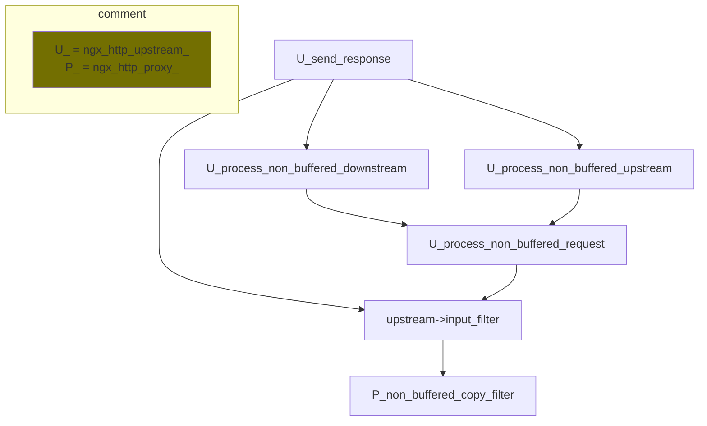

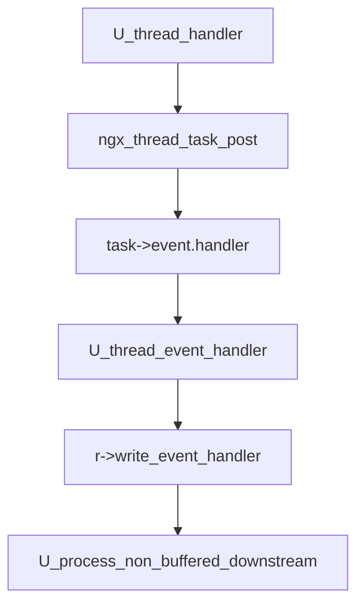